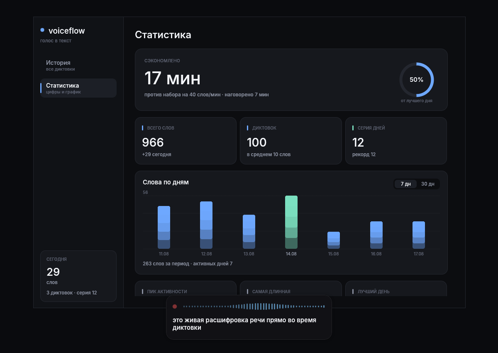
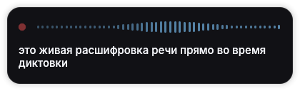
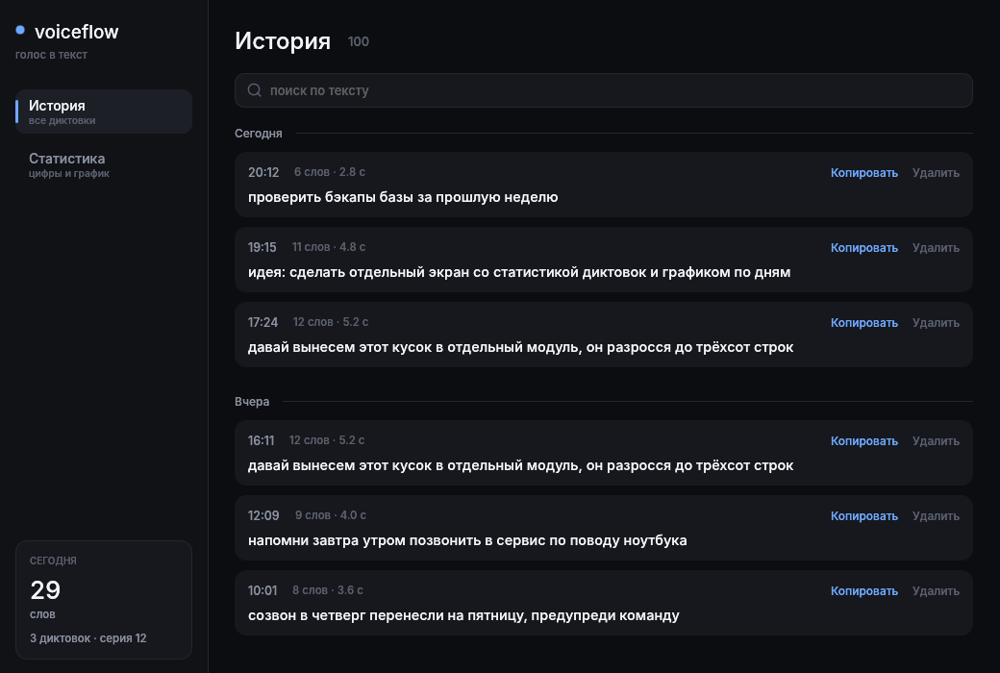

<h1 align="center">voiceflow</h1>

<p align="center">
  Local voice dictation for Linux. Tap a hotkey, speak, and the text lands in whatever you were typing in.
</p>

<p align="center">
  
</p>

<p align="center">
  <a href="#license"></a>
  
  
</p>

---

Speech never leaves the machine. Recognition runs on the CPU with NVIDIA's
Nemotron streaming model, so there is no API key, no account, and no network
call anywhere in the path.

Built because the good dictation apps are all macOS-only. It borrows its shape
from [FluidVoice](https://github.com/altic-dev/FluidVoice) and rebuilds it on a
Linux-native stack.

## Features

- **Live preview.** Words appear in a floating card while you speak, roughly 0.7 s behind your voice, with a level meter that moves with it.
- **Types into any app.** The finished text is pasted where your cursor already was — editor, browser, chat.
- **25 languages.** Nemotron 0.6B streaming, multilingual, with automatic detection. Russian and English are in the top accuracy tier.
- **Fully offline.** No key, no account, no telemetry. About 4× realtime headroom on a laptop CPU, no GPU needed.
- **History and stats.** Every dictation is stored locally in SQLite, searchable and copyable, with a dashboard of what you saved.
- **Stays out of the way.** The overlay never steals keyboard focus, so it cannot break the paste target.

## Screenshots

| Live overlay | History |
| --- | --- |
|  |  |

## Requirements

- Linux with PipeWire or ALSA, and a microphone
- Wayland or X11 (developed on GNOME 46 / Ubuntu 24.04)
- Rust 1.85+ (2024 edition)
- [`wl-clipboard`](https://github.com/bugaevc/wl-clipboard) and [`ydotool`](https://github.com/ReimuNotMoe/ydotool) for pasting
- ~2.6 GB of disk for the model

Build dependencies on Debian/Ubuntu:

```sh
sudo apt install libasound2-dev libssl-dev pkg-config fonts-inter
```

## Install

Grab a package from [Releases](https://github.com/MargoRSq/voiceflow/releases):

```sh
sudo apt install ./voiceflow_*_amd64.deb     # Debian, Ubuntu
sudo dnf install ./voiceflow-*.x86_64.rpm    # Fedora, RHEL
```

Or the portable tarball for anything else:

```sh
tar -xzf voiceflow-*-x86_64-linux-gnu.tar.gz
install -Dm755 voiceflow ~/.local/bin/voiceflow
```

Builds exist for `x86_64` and `aarch64`. They need **glibc 2.39 and
libstdc++ 13** or newer — Ubuntu 24.04+, Debian 13+, Fedora 40+, Arch,
Tumbleweed. Ubuntu 22.04 and Debian 12 are too old.

That floor comes from the prebuilt ONNX Runtime that `ort` links in, not from
this code. For the same reason there is no musl build and Alpine is
unsupported: upstream publishes `linux-gnu` binaries only. On an older
distribution, build from source against your own toolchain.

### From source

```sh
git clone https://github.com/MargoRSq/voiceflow
cd voiceflow
cargo build --release
install -Dm755 target/release/voiceflow ~/.local/bin/voiceflow
```

Fetch the model (~2.6 GB) into the data directory:

```sh
M=~/.local/share/voiceflow/models/nemotron_multi
B=https://huggingface.co/altunenes/parakeet-rs/resolve/main/nemotron-3.5-asr-streaming-0.6b-onnx
mkdir -p "$M"
for f in config.json tokenizer.model encoder.onnx decoder_joint.onnx encoder.onnx.data; do
  curl -sL --retry 3 -o "$M/$f" "$B/$f"
done
```

Run the daemon at login, and register the history window as a desktop app:

```sh
./scripts/install-service.sh
./scripts/install-desktop.sh
```

`ydotool` needs its daemon running and access to `/dev/uinput`:

```sh
sudo usermod -aG input "$USER"   # log out and back in
systemctl --user enable --now ydotoold
```

## Usage

Tap **Alt+Shift**, speak, tap again. The overlay shows the transcript as it
forms; on the second tap the text is pasted where you were typing.

The chord fires only on a clean tap — `Alt+Shift+Tab` and friends still belong
to your window manager.

```sh
voiceflow            # daemon (usually started by systemd)
voiceflow toggle     # start/stop recording; bind this to any key you like
voiceflow ui         # history window
voiceflow ui stats   # open it on the dashboard
```

Drag the overlay anywhere; it remembers where you left it.

### A hotkey that is not Alt+Shift

Modifier-only chords cannot be expressed as a GNOME keybinding, which is why
Alt+Shift is read from evdev directly. For an ordinary shortcut, bind
`voiceflow toggle` in **Settings → Keyboard → Custom Shortcuts** instead.

## Configuration

Environment variables, all optional:

| Variable | Default | Purpose |
| --- | --- | --- |
| `VOICEFLOW_LANG` | `ru-RU` | Target language, or `auto` to detect |
| `VOICEFLOW_MODEL` | `~/.local/share/voiceflow/models/nemotron_multi` | Model directory |
| `VOICEFLOW_DB` | `~/.local/share/voiceflow/history.sqlite3` | History database |
| `VOICEFLOW_KBD` | Toshy's virtual keyboard, else the first keyboard | evdev device for the hotkey |

Set them for the service with `systemctl --user edit voiceflow.service`.

## How it works

```
hotkey (evdev) ─┐
                ├─> daemon ─> cpal ─> 16 kHz mono ─> Nemotron ─> overlay (live)
socket ─────────┘                                        └────> clipboard + Ctrl+V
                                                         └────> SQLite history
```

Audio is captured with `cpal`, downmixed and resampled to 16 kHz, and fed to the
model in 560 ms chunks. The model is cache-aware and streaming, so partial text
is real output rather than a re-run over a sliding window. Inference costs about
150 ms per chunk on a laptop CPU.

Two details are Linux-specific and worth knowing before you read the code:

- **The overlay is an X11 window even on Wayland.** GNOME does not implement
  `wlr-layer-shell`, so an always-on-top card that never takes focus is built as
  an override-redirect X11 window through XWayland. The history window is a
  normal Wayland window; the daemon drops `WAYLAND_DISPLAY` for itself so winit
  picks the right backend per process.
- **Text is pasted, not typed.** `ydotool type` mangles non-Latin layouts, so the
  transcript goes through the clipboard and a synthetic Ctrl+V.

## Limitations

- The clipboard is left holding the dictated text; the previous contents are not restored.
- Pasting assumes Ctrl+V works in the target app — terminals and Vim need their own binding.
- The interface is in Russian, though recognition is multilingual.
- Tested on GNOME 46 under Wayland. Other compositors should work, but the overlay path is only exercised there.

## Development

```sh
cargo test                              # 24 tests, no hardware needed
cargo run --release -- preview          # overlay with canned data
VOICEFLOW_SEED_DB=/tmp/h.sqlite3 cargo run --release --example seed
VOICEFLOW_DB=/tmp/h.sqlite3 cargo run --release -- ui
```

Any window can screenshot itself, which is how the images above were made —
GNOME refuses external capture:

```sh
VOICEFLOW_SHOT=out.png cargo run --release -- ui stats
```

## Credits

- [parakeet-rs](https://github.com/altunenes/parakeet-rs) — ONNX runtime bindings for the model
- [NVIDIA Nemotron / Parakeet](https://huggingface.co/nvidia/nemotron-3.5-asr-streaming-0.6b) — the speech model itself
- [FluidVoice](https://github.com/altic-dev/FluidVoice) — the macOS app this one is shaped after
- [egui](https://github.com/emilk/egui) — the interface

## License

Dual licensed under either [MIT](LICENSE-MIT) or [Apache 2.0](LICENSE-APACHE),
at your option. Model weights are NVIDIA's and carry their own terms.
